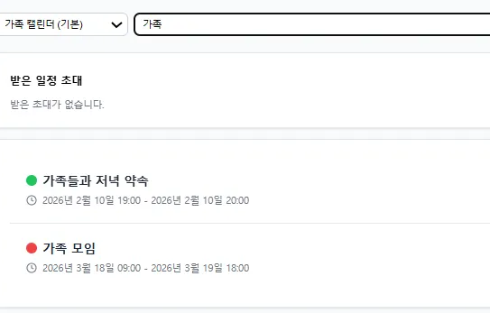
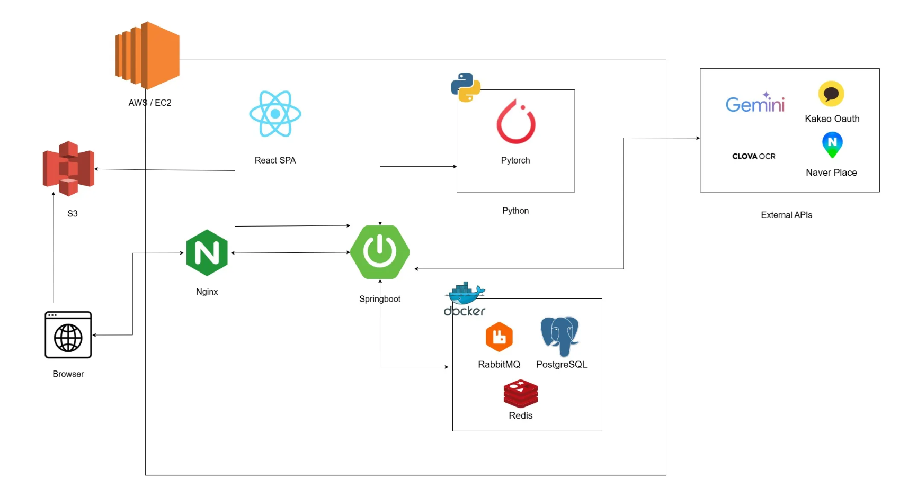

### 📆 Calendar Box (캘박)
공유 캘린더 기반 일정 관리 서비스

<b>목차</b>

  
- [프로젝트 소개](#프로젝트-소개)
- [주요 기능](#주요-기능)
  - [홈](#홈)
  - [캘린더](#-캘린더)
  - [일정](#️%EF%B8%8F일정)
  - [친구](#-친구)
  - [통계 및 분석](#-통계-및-분석)
- [기술 스택](#기술-스택)
- [서비스 아키텍처](#서비스-아키텍처)
- [역할](#역할)
- [확장성](#확장성)
- 

## 프로젝트 소개

**Calendar Box**는 여러 모임과 일정을 효율적으로 관리하기 위한 

**공유 캘린더 기반 일정 관리 서비스**입니다.

개인 일정부터 그룹 모임까지 하나의 플랫폼에서 관리할 수 있으며,

일정에 **참여자·장소·첨부파일·지출·통계** 등 다양한 하위 리소스를 결합하여

기억과 기록을 함께 남길 수 있습니다.

---

## 주요 기능

### 🏠홈

- 상단 -  오늘 일정 수, 친구 수, 캘린더 수 표시
- 중앙 -  내 모든 캘린더에 등록된 종합 일정이 표시된 캘린더 뷰
- 우측 -  오늘 일정 정보&오늘 날짜 제외 예정된 일정 정보 표시
- 좌측 -  네비게이터 원하는 페이지로 이동

### 📅 캘린더

그룹별 캘린더 뷰 분리

그룹 캘린더 **멤버** 기능

 **공개 범위** 설정으로 안전한 일정 관리

캘린더 **상세 정보** 및 **히스토리**

### ☀️일정

구성: 제목, 시작 시간, 종료 시간, 테마(색상), 메모
하위리소스: 장소, 참가자, 투두, 반복, 리마인더, 링크, 지출/세부 지출, 첨부파일(이미지/파일/영수증)

장소 검색으로 편리한 일정 장소 등록 및 장소 순서 변경 가능

일정 지역 입력 시 **장소 추천**

다양한 **참가자** 추가 기능

**반복 기능**으로 효율적인 일정 등록/수정/삭제

**첨부 파일** 업로드/미리보기/다운로드

 **색상**으로 구분

일정별 **지출 관리** 기능

**영수증 업로드**를 통한 **지출/지출 세부 항목 등록** 기능

그 외 다양한 일정 하위 리소스 기능(투두, 리마인더, 링크)

일정 관리 탭에서 캘린더별 **일정 목록 조회** 가능 & 일정 **검색** 가능 & 일정 초대 **수락/거절** 가능

### 👥 친구

**친구 목록**

이름/이메일/전화번호로 유저 **검색** 및 **친구 요청**

메일 주소 입력으로 바로 친구 요청 가능

 **받은 친구 요청** 조회 및 수락/거절 가능

**보낸 친구 요청** 조회 및 취소 가능

### 📊 통계 및 분석

사람 통계 - 만난 횟수 순으로 **요약 및 분석** 정보 제공

장소 통계 - 방문 횟수 순으로 **요약 및 분석** 정보 제공

월별 통계 - **월별 스케줄 추이** 제공 및 스케줄 수 확인 가능

요일별 통계 - **요일별 스케줄 분포** 및 스케줄 수 확인 가능

시간대별 통계 - **요일-시간대별** 스케줄 분포 제공

---

## 기술 스택

### Frontend

### Backend

### ML

### DB / Infra

### External APIs

---

## 서비스 아키텍처

---

## 역할

🌱남승혁 - PM / Infra / Backend

❤️마강현 - Frontend / Design

---

## 확장성

공개 그룹 생성 및 가입 요청/활동 등으로 확장 가능(오픈카카오톡)

공개 일정 등록 및 조회/참가/활동 등으로 커뮤니티 기능으로 확장 가능(당근모임)
